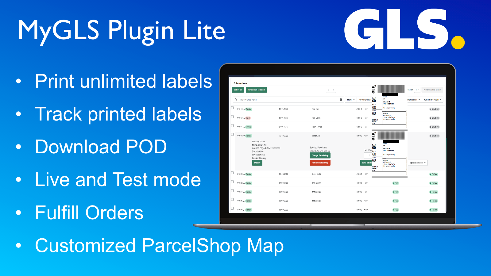

# MyGLS Plugin Lite (Eastern Europe)

[Shopify App Store Link](https://apps.shopify.com/mygls-plugin-lite)

### Used Technologies:

# Description

The code itself for business reasons is secret, but i will describe how the architecture and the flow works.

## Shopify applications

---

### Application types

There are two different type of applications by Shopify

- Standalone
- Embded

This product is an MVP, so it was to choose the embedded type of the application.
The shopify ecosystem provides a couple of features, what makes the integration and the development experience "smooth".
There were a couple of difficulties with ofCourse, but relying on the community, all of the questionable parts of the structure were answered.

## Code

---

### Backend

- The backend code is NodeJS and the communication between the app and the shopify works via GraphQL.
- The application has been separated into different layers.

- Controllers
- Facade (Where the logic happens)
- DataAccessLayer

- I have used the latest Ecmascript features, and there is no callback hell at all.

### Frontend

- The frontend has been written in React.
- For global state managing i have used Redux.
- The final product runs in an Iframe in the Webshop onwner's admin page, so the url query handling was very difficult to solve it.

### Hosting

- The Docker container runs on DigitalOcean.
- The reason why i have chosen this way, is the product's actual status(MVP).
- I am familiar with the latest CI/CD solutions, but by the DigitalOcean thoose features are provided out of the box for the basic plans as well, so i didn't have to implement in the native way.

## The Product

---

### What is GLS

GLS Group offers parcel, logistics and express services, throughout Europe as well as in the US and in Canada.

The center of the Eastern European region is located in Hungary.

The following countries are included in this part

- Hungary
- Slovakia
- Slovenia
- Czech Republic
- Croatia
- Romania

---

### GLS API

The GLS Eastern Europe region has an official API named "MyGLS"

This API works in the mentioned countries above only.

Through the API we can do the following things

- Print Labels with Barcode
- Print Exchange Labels
- Send Pick up orders
- Get the Parcel's status
- Get Printed ParcelLists

The documentation is not the best that i have read so far, but it does the job.

[MyGLS API documentation](https://api.mygls.hu)

This api can be used with SOAP and REST api as well. I hope it won't surprise You, but I have chosen the REST one.

---

## MyGLS Plugin Lite

### The main feature of this application is to print all of the webshop orders by one click!

### Features

- Print Bulk orders
- Fulfill Bulk orders
- Send Pick & Return orders
- Create exchange service labels
- Create a fully customizable parcelShop map into the webshop's cart page
- Print multiple labels by one order. (1/3 2/3 3/3)
- Set the default MyGLS services (SMS/Email/Etc.)
- Set default Label type and printing position
- Set or modify the order's Shipping address
- Set the shipping destination into a ParcelShop/ParcelLocker
- Download The POD Documents of the orders
- Check Bulk printed orders's statuses, and when they are delivered, the application will close those orders.

---

### ParcelShop Map integration

For UX reasons, the best way to insert a ParcelShop map into the webshop would be the checkout page, when the customer chooses the delivery methods.
When the webshop has an active Shopify Plus subscription, than the developer has access to modify the user's checkout page.

Most of the users have a basic plan, so i had to find another solution for them.

In this case we can insert the script into their car page.
Not the best way to do that, but it does the job.

Customizable parts of the integration:

- Set custom Button title
- Set custom "Selected ParcelShop" title
- Custom Color and Border color
- Custom border width and radius
- Optional 4 different GLS logo

---

## Distribution

[Shopify App Store Link](https://apps.shopify.com/mygls-plugin-lite)

The application has been published into the Shopify App store

The business modell is an SaaS (Software as a service)

There are two different plans

Demo Plan: Free

- Print 2 labels/day

Basic Plan: 5 $/30 days

- Print Labels WITHOUT any limit

---

## Summary

The Active development was more than 3 months long. It means i woke up EVERY day at 4 am to create this app, beside my Main Job (FullStack Developer).

It was challenging to keep the ballance in my life. I have a Wife and a Son as well, without their support i could never make this plugin.

I hope you found it interesting. If you have questions, or just would like to chat about it, please feel free to contact me.

Best Wishes

Ákos
